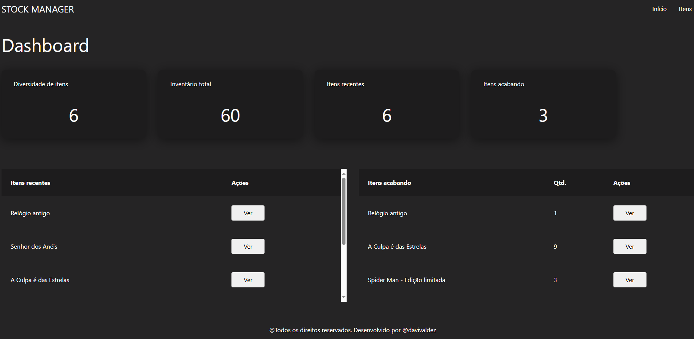
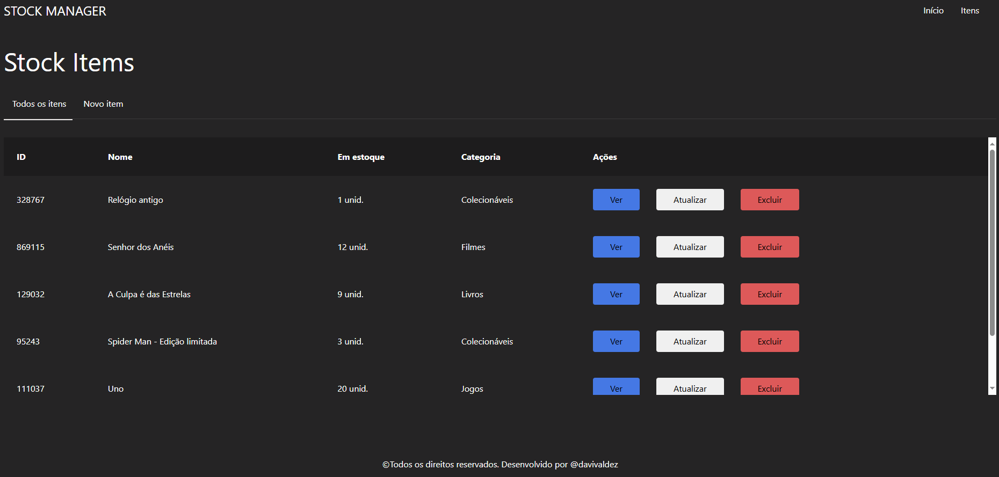
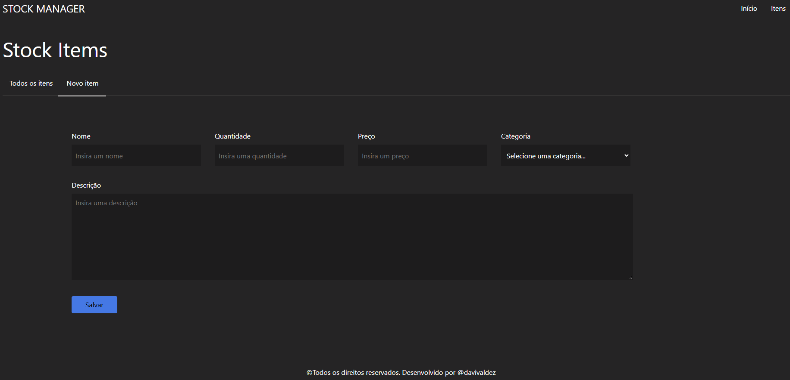
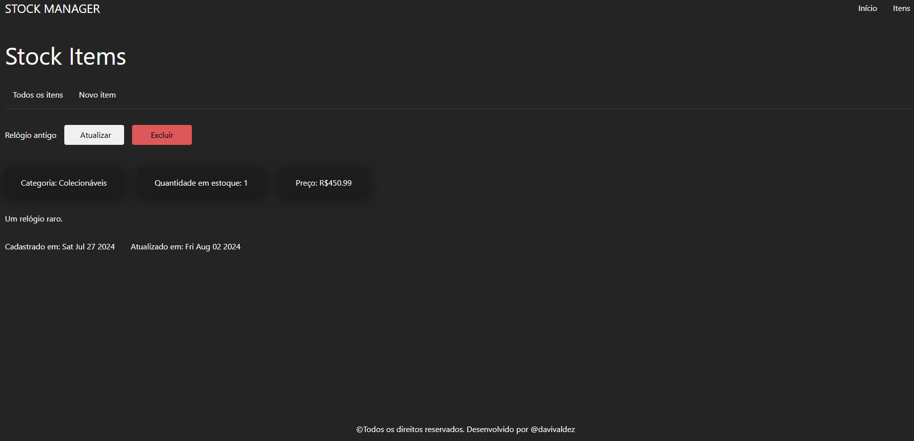
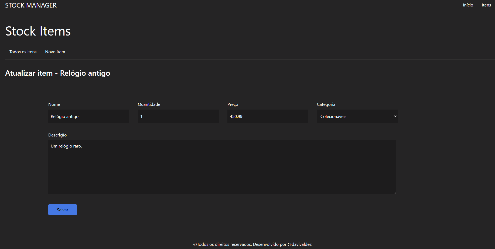

<h1 align="center" style="font-weight: bold;">Stock Manager 📋</h1>

 <a href="#descrição">Descrição</a> • 
 <a href="#tecnologias-utilizadas">Tecnologias utilizadas</a> • 
 <a href="#uso">Uso</a> •
 <a href="#contribuição">Contribuição</a> •
 <a href="#contribuidores">Contribuidores</a> •
 <a href="#licença">Licença</a> 

    

## Descrição

Stock Manager é uma SPA desenvolvida com React, React Router e Vite para gerenciar inventário de itens, incluindo um dashboard com métricas, listagem e páginas para criar, atualizar e deletar itens. Todos os dados são persistidos no LocalStorage, e a navegação é client-side para uma experiência fluida.

## Tecnologias utilizadas:

- Node.js.
- React.
- React Router.
- JavaScript.
- CSS.
- Bootstrap.
- Vite.

## Uso

Para usar a aplicação, acesse o dashboard para visualizar informações sobre seu estoque, incluindo itens adicionados recentemente e aqueles com estoque baixo. Navegue para a página de itens para ver a lista completa, onde você pode visualizar detalhes, atualizar ou excluir itens.

Adicione novos itens na tela de criação e atualize-os na tela correspondente. A navegação é fluida, sem recarregar a página, e todos os dados são armazenados no LocalStorage, garantindo que suas informações sejam preservadas.

A aplicação é responsiva e fácil de usar em dispositivos móveis e desktops.

### Clonando repositório:

    git clone https://github.com/davivaldez/StockManager.git

### Alterando diretório:

    cd StockManager/

### Instalando dependências do package.json:

    npm install

### Inicializando a aplicação:

    npm run dev

### Tela inicial

    

### Inventário de itens

    

### Criação de novos itens

    

### Ver item

    

### Atualizar item

    

## Contribuição

Contribuições são bem-vindas! Siga as etapas abaixo para contribuir com o projeto:

1. Faça um **Fork** no repositório.
2. Crie uma **branch** para suas mudanças.
3. Faça um **commit** das suas alterações.
4. Envie suas mudanças com um **push**.
5. Abra um **Pull Request**.

Obrigado por contribuir!

## Contribuidores

Atualmente, este projeto é mantido por um único contribuidor:

<table>
  <tr>
    <td align="center">
      <a href="https://github.com/davivaldez">
         
        

          <b>Davi Valdez</b>
        

      </a>
    </td>
  </tr>
</table>

Embora eu seja o único contribuidor até o momento, este projeto é aberto para contribuições da comunidade. Se você estiver interessado em contribuir, siga as instruções na seção de [Contribuição](#contribuição). Obrigado pelo seu interesse!

## Licença

Este projeto está licenciado sob a [MIT licensed](./LICENSE).
